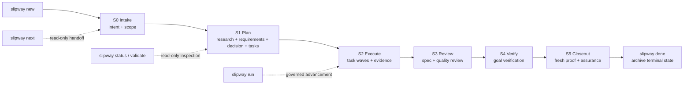

# Slipway

Slipway is a governance CLI for AI-assisted software delivery inside a local Git repository.

It turns agent work into a durable, inspectable change record: intent, research, requirements, decisions, tasks, implementation evidence, review evidence, and final closeout all live next to the code. AI tools can help execute the work, but Slipway keeps the lifecycle authority in the repository.

## Why Slipway

AI coding tools are fast at changing files and weak at preserving accountable process. Slipway exists to make that process explicit.

| Need | Slipway answer |
| --- | --- |
| Know what the agent is allowed to do | Capture intent, scope, open questions, and guardrail classification before execution. |
| Avoid plan drift | Bind implementation to `requirements.md`, `decision.md`, `tasks.md`, and review evidence. |
| Keep state auditable | Store current authority in `change.yaml` and append mutating lifecycle events to `events/lifecycle.jsonl`. |
| Work across AI tools | Generate adapter surfaces for Claude, Codex, Cursor, Gemini, and OpenCode. |
| Finish with proof | Require fresh verification and assurance before `done`. |

## Design Philosophy

- **Local-first governance**: the repository is the system of record. Slipway does not require a hosted service to explain what happened.
- **One current authority**: `artifacts/changes/<slug>/change.yaml` owns lifecycle state; logs and Markdown files support it but do not replace it.
- **Evidence before confidence**: tests, builds, review records, and assurance artifacts are proof surfaces, not after-the-fact notes.
- **AI tools are adapters**: host-specific skills, commands, hooks, and prompts route back into the same CLI instead of creating parallel workflows.
- **Human-readable, machine-checkable artifacts**: Markdown remains readable to people, while stable sections and YAML records give the runtime something deterministic to inspect.
- **Smallest useful control plane**: Slipway stays narrower than adjacent spec, workflow, and agent frameworks by keeping governance authority in the CLI and repository artifacts.

See [Design Philosophy](docs/design.md) for the longer architecture explanation.

## Core Capabilities

| Capability | What it gives you |
| --- | --- |
| Governed change lifecycle | Intake, planning, execution, review, goal verification, closeout, and archive steps instead of one unstructured agent session. |
| Artifact bundle | `intent.md`, `research.md`, `requirements.md`, `decision.md`, `tasks.md`, `assurance.md`, and verification records under one change slug. |
| JSON handoff surfaces | `next`, `run`, `status`, `review`, `validate`, and `done` support structured output for AI tools and scripts. |
| Worktree-aware execution | Governed changes can run in dedicated `.worktrees/<slug>` checkouts while preserving local audit evidence. |
| AI-tool adapters | Generated skills, commands, prompts, and hooks for Claude, Codex, Cursor, Gemini, and OpenCode. |
| Repair and diagnostics | `health`, `validate`, `repair`, `stats`, and `codebase-map` help inspect or recover local governance state. |

## Lifecycle



The primary lifecycle commands are `slipway new`, `slipway next`, `slipway run`, `slipway status`, and `slipway done`.

## Install

Slipway can be installed or built several ways. The full platform matrix is in [Installation](docs/installation.md).

| Platform | Main paths |
| --- | --- |
| macOS | Direct `darwin_amd64` / `darwin_arm64` release archive, or Homebrew Cask when published |
| Linux | Direct `linux_amd64` / `linux_arm64` release archive, `.deb`, `.rpm`, `.apk`, container image, or AUR when published |
| Windows | Direct `windows_amd64` / `windows_arm64` release zip, or Scoop when published |
| Developer fallback | `go install github.com/signalridge/slipway@latest`, Nix, or build from checkout |

Prefer published release artifacts or release-backed package-manager channels for normal installation. Treat GitHub Releases under `signalridge/slipway`, `ghcr.io/signalridge/slipway`, `signalridge/tap`, `signalridge/scoop-bucket`, and `slipway-bin` as the documented release sources; stop and verify before using same-name packages from unrelated registries. Use `go install`, Nix, or a local source build when you need a developer fallback, a not-yet-packaged platform path, or unreleased code.

## Quick Install

With Go:

```bash
go install github.com/signalridge/slipway@latest
slipway --help
```

From a local checkout for development:

```bash
go build -o ./bin/slipway .
./bin/slipway --help
```

Initialize Slipway in a repository:

```bash
slipway init --tools codex
slipway init --tools claude,cursor,opencode
slipway init --tools all
```

Omitting `--tools` creates only `.slipway.yaml`. Use `--refresh` to regenerate already managed adapters deterministically.

## Quick Workflow

```bash
slipway new "refresh governance docs" --preset standard
slipway next --json
# execute the surfaced skill or resolve blockers
slipway run --json --diagnostics
slipway status --json
slipway done --json
```

`next`, `status`, and `validate` are read-only inspection surfaces. `run`, `new`, `preset`, `checkpoint`, `repair`, `cancel`, `abort`, and `done` can mutate local governed state.

## AI Tool Adapters

Generate host-tool surfaces with `slipway init --tools`.

| Tool | Generated surfaces |
| --- | --- |
| Claude | `.claude/skills/slipway-*/SKILL.md`, `.claude/commands/slipway/*.md` |
| Codex | `.codex/skills/slipway-*/SKILL.md`, `$CODEX_HOME/prompts/slipway-*.md` |
| Cursor | `.cursor/skills/slipway-*/SKILL.md`, `.cursor/commands/*.md` |
| Gemini | `.gemini/skills/slipway-*/SKILL.md`, `.gemini/commands/slipway/*.toml` |
| OpenCode | `.opencode/skills/slipway-*/SKILL.md`, `.opencode/commands/slipway-*.md`, `.opencode/hooks/slipway-session-start.sh` |

The AI-tool installation prompt in [Installation](docs/installation.md#ai-tool-installation-prompt) is written for copy-paste use in tools such as OpenCode, Codex, and Claude Code.

## Runtime Files

- `artifacts/changes/`: governed change bundles, including `change.yaml`, lifecycle events, Markdown artifacts, and verification evidence.
- `artifacts/codebase/`: advisory repo-scoped codebase maps generated by `slipway codebase-map`.

## Documentation

- [Installation](docs/installation.md): platform packages, source builds, repository initialization, and AI-tool install prompt.
- [Design Philosophy](docs/design.md): governing principles, authority boundaries, and adjacent-system tradeoffs.
- [Governed Workflow](docs/workflow.md): lifecycle states, read-only surfaces, mutating commands, and Open Questions semantics.
- [Command Reference](docs/commands.md): core, situational, and diagnostics commands.
- [AI Tool Adapters](docs/ai-tools.md): generated paths and host invocation styles.
- [Operator Guide](docs/operator-guide.md): worktrees, state authority, health, repair, verification, and closeout.
- [Contributing](docs/contributing.md): repo layout, docs build, adapter contracts, and governance tests.

## Verification

Use focused package tests while developing, then run the full local proof before closeout:

```bash
go test -timeout=20m ./... -count=1
go build ./...
go vet ./...
mkdocs build --strict
```

CI also runs Markdown/YAML/action linting, Go tests across platforms, race tests, build checks, security scans, release checks, Nix checks, and the docs workflow in `.github/workflows/docs.yml`.
