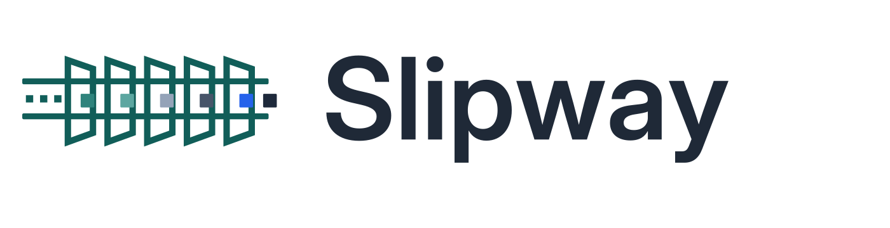

<div align="center">



<p>
  <a href="https://github.com/signalridge/slipway/actions/workflows/ci.yml"></a>&nbsp;
  <a href="https://github.com/signalridge/slipway/actions/workflows/docs.yml"></a>&nbsp;
  <a href="https://github.com/signalridge/slipway/releases"></a>&nbsp;
  <a href="https://pkg.go.dev/github.com/signalridge/slipway"></a>
</p>

<p>
  <a href="docs/installation.md"></a>
  <a href="docs/installation.md"></a>
  <a href="docs/installation.md"></a>
  <a href="docs/installation.md"></a>
  <a href="docs/installation.md"></a>
  <a href="docs/installation.md"></a>
  <a href="docs/installation.md"></a>
  <a href="docs/installation.md"></a>
  <a href="docs/installation.md"></a>
</p>

[Documentation](https://signalridge.github.io/slipway/) | [Installation](docs/installation.md) | [Release Notes](CHANGELOG.md)

</div>

# Slipway

Slipway is a governance CLI for AI-assisted software delivery inside a local Git repository.

It turns agent work into a durable, inspectable change record: intent, research, requirements, decisions, tasks, implementation evidence, review evidence, and final closeout all live next to the code. AI tools can help execute the work, but Slipway keeps the lifecycle authority in the repository.

## Why Slipway

AI coding tools are fast at changing files and weak at preserving accountable process. Slipway exists to make that process explicit.

| Need | Slipway answer |
| --- | --- |
| Know what the agent is allowed to do | Capture intent, scope, open questions, and guardrail classification before execution. |
| Avoid plan drift | Bind implementation to `requirements.md`, `decision.md`, `tasks.md`, and review evidence. |
| Keep state auditable | Store current authority in `change.yaml` and append mutating lifecycle events to `events/lifecycle.jsonl`. |
| Work across AI tools | Generate adapter surfaces for Claude, Codex, Cursor, Gemini, and OpenCode. |
| Finish with proof | Require fresh verification and assurance before `done`. |

## Design Philosophy

- **Local-first governance**: the repository is the system of record. Slipway does not require a hosted service to explain what happened.
- **One current authority**: `artifacts/changes/<slug>/change.yaml` owns lifecycle state; logs and Markdown files support it but do not replace it.
- **Evidence before confidence**: tests, builds, review records, and assurance artifacts are proof surfaces, not after-the-fact notes.
- **AI tools are adapters**: host-specific skills, commands, hooks, and prompts route back into the same CLI instead of creating parallel workflows.
- **Human-readable, machine-checkable artifacts**: Markdown remains readable to people, while stable sections and YAML records give the runtime something deterministic to inspect.
- **Smallest useful control plane**: Slipway stays narrower than adjacent spec, workflow, and agent frameworks by keeping governance authority in the CLI and repository artifacts.

See [Design Philosophy](docs/design.md) for the longer architecture explanation.

## Core Capabilities

| Capability | What it gives you |
| --- | --- |
| Governed change lifecycle | Intake, planning, execution, review, goal verification, closeout, and archive steps instead of one unstructured agent session. |
| Artifact bundle | `intent.md`, `research.md`, `requirements.md`, `decision.md`, `tasks.md`, `assurance.md`, and verification records under one change slug. |
| JSON handoff surfaces | `next`, `run`, `status`, `review`, `validate`, and `done` support structured output for AI tools and scripts. |
| Worktree-aware execution | Governed changes can run in dedicated `.worktrees/<slug>` checkouts while preserving local audit evidence. |
| AI-tool adapters | Generated skills, commands, prompts, and hooks for Claude, Codex, Cursor, Gemini, and OpenCode. |
| Repair and diagnostics | `health`, `validate`, `repair`, `stats`, and `codebase-map` help inspect or recover local governance state. |

## Lifecycle

```mermaid
%%{init: {"theme": "base", "themeVariables": {"fontFamily": "Inter, ui-sans-serif, system-ui, sans-serif", "primaryColor": "#f8fafc", "primaryTextColor": "#0f172a", "primaryBorderColor": "#115e59", "lineColor": "#64748b", "tertiaryColor": "#ecfeff"}}}%%
flowchart LR
  classDef entry fill:#ecfeff,stroke:#115e59,stroke-width:2px,color:#0f172a
  classDef plan fill:#eef2ff,stroke:#2563eb,stroke-width:2px,color:#0f172a
  classDef execute fill:#f8fafc,stroke:#475569,stroke-width:2px,color:#0f172a
  classDef review fill:#fff7ed,stroke:#c2410c,stroke-width:2px,color:#0f172a
  classDef verify fill:#f0fdf4,stroke:#15803d,stroke-width:2px,color:#0f172a
  classDef complete fill:#111827,stroke:#111827,stroke-width:2px,color:#ffffff
  classDef loop fill:#f8fafc,stroke:#94a3b8,stroke-dasharray: 5 5,color:#334155

  start((new)):::entry --> intake["Intake<br/>intent + guardrail classification"]:::entry
  intake --> planNode["Plan<br/>research + requirements + tasks"]:::plan
  planNode --> executeNode["Execute<br/>wave work + evidence"]:::execute
  executeNode --> reviewNode["Review<br/>domain + independent checks"]:::review
  reviewNode --> verifyNode["Verify<br/>assurance + goal proof"]:::verify
  verifyNode --> closeout["Closeout<br/>fresh proof + archive ready"]:::verify
  closeout --> doneNode((done)):::complete

  intake -. clarify / research .-> intake
  planNode -. audit blockers .-> planNode
  executeNode -. wave blockers .-> executeNode
  reviewNode -. changes requested .-> executeNode

  commandLoop["Primary command loop<br/>next inspects<br/>run advances<br/>status reports"]:::loop
  commandLoop -.-> intake
  commandLoop -.-> executeNode
  commandLoop -.-> verifyNode
```



The primary lifecycle commands are `slipway new`, `slipway next`, `slipway run`, `slipway status`, and `slipway done`.
If planning evidence drifts after execution or review, `slipway next` reports
the recovery path without mutating state, while `slipway run` can reopen
planning, clear stale planning/downstream verification evidence, and preserve
runtime execution evidence for ordered refresh.

## Install

Slipway can be installed or built several ways. The full platform matrix is in [Installation](docs/installation.md).

| Platform | Main paths |
| --- | --- |
| macOS | Direct `darwin_amd64` / `darwin_arm64` release archive, or Homebrew Cask when published |
| Linux | Direct `linux_amd64` / `linux_arm64` release archive, `.deb`, `.rpm`, `.apk`, container image, or AUR when published |
| Windows | Direct `windows_amd64` / `windows_arm64` release zip, or Scoop when published |
| Developer fallback | `go install github.com/signalridge/slipway@latest`, Nix, or build from checkout |

Prefer published release artifacts or release-backed package-manager channels for normal installation. Treat GitHub Releases under `signalridge/slipway`, `ghcr.io/signalridge/slipway`, `signalridge/tap`, `signalridge/scoop-bucket`, and `slipway-bin` as the documented release sources; stop and verify before using same-name packages from unrelated registries. Use `go install`, Nix, or a local source build when you need a developer fallback, a not-yet-packaged platform path, or unreleased code.

## Quick Install

With Go:

```bash
go install github.com/signalridge/slipway@latest
slipway --help
```

From a local checkout for development:

```bash
go build -o ./bin/slipway .
./bin/slipway --help
```

Initialize Slipway in a repository:

```bash
slipway init --tools codex
slipway init --tools claude,cursor,opencode
slipway init --tools all
```

Omitting `--tools` creates only `.slipway.yaml`. Use `--refresh` to regenerate already managed adapters deterministically.

## AI-Agent Install

Paste the prompt below into an AI coding tool to have it install and initialize Slipway for the current repository. Read it before pasting and supervise the agent while it runs. The prompt is short on purpose — it points the agent at the canonical [AI Tool Installation Prompt](docs/installation.md#ai-tool-installation-prompt) section, which carries the full Discovery / Install / Initialize / Verify / Report guidance.

```text
Install Slipway for this repository.

Read https://signalridge.github.io/slipway/installation/ — specifically the
"AI Tool Installation Prompt" section — and follow it.

Before installing, detect the operating system and CPU architecture, and run
`slipway --version` to see if Slipway is already on PATH. Prefer documented
release sources owned by the Slipway project (the `signalridge` org). Do NOT
install same-name packages from unrelated registries. If no documented path
applies, stop and report.

After installing, run `slipway --version`, `slipway status --json`, and
`git status --short --branch`. Report which install path succeeded and what
files were generated (especially `.slipway.yaml` and adapter directories).
```

## Quick Workflow

```bash
slipway new "refresh governance docs" --preset standard
slipway next --json
# execute the surfaced skill or resolve blockers
slipway run --json --diagnostics
slipway status --json
slipway done --json
```

`next`, `status`, and `validate` are read-only inspection surfaces. `run`, `new`, `preset`, `checkpoint`, `repair`, `cancel`, `abort`, and `done` can mutate local governed state.
Diagnostic JSON uses explicit review and freshness contracts: review evidence
must record exact layer tokens such as `layer:R0=pass` or `layer:IR1=pass`, and
execution freshness is based on structural task inputs rather than legacy
`evidence_input_hash`; legacy hash-only summaries remain parseable only so
diagnostics can mark them stale.

## AI Tool Adapters

Generate host-tool surfaces with `slipway init --tools`.

| Tool | Generated surfaces |
| --- | --- |
| Claude | `.claude/skills/slipway-*/SKILL.md`, `.claude/commands/slipway/*.md` |
| Codex | `.codex/skills/slipway-*/SKILL.md`, `$CODEX_HOME/prompts/slipway-*.md` |
| Cursor | `.cursor/skills/slipway-*/SKILL.md`, `.cursor/commands/*.md` |
| Gemini | `.gemini/skills/slipway-*/SKILL.md`, `.gemini/commands/slipway/*.toml` |
| OpenCode | `.opencode/skills/slipway-*/SKILL.md`, `.opencode/commands/slipway-*.md`, `.opencode/hooks/slipway-session-start.sh` |

The AI-tool installation prompt in [Installation](docs/installation.md#ai-tool-installation-prompt) is written for copy-paste use in tools such as OpenCode, Codex, and Claude Code.

## Runtime Files

- `artifacts/changes/`: governed change bundles. `artifacts/changes/<slug>/change.yaml` and top-level Markdown artifacts are project records. Active records are runtime authority; archived records stay in the owning workspace in a Git-safe form with archive-local artifact paths.
- `artifacts/changes/**/evidence/`, `artifacts/changes/**/events/`, and `artifacts/changes/**/verification/` are raw local proof directories by default. Keep them for local audit and validation; they are ignored by Slipway-managed `.gitignore` rules.
- `artifacts/codebase/` contains advisory repo-scoped codebase maps generated by `slipway codebase-map`; they are git-tracked by default so durable brownfield context is reviewed and shared rather than hidden as local-only state. Existing repositories auto-migrate the next time `slipway new`, `slipway codebase-map`, or `slipway init` rewrites the managed `.gitignore` block.
- `.worktrees/` contains dedicated governed worktrees and is local-only by default.

## Documentation

- [Installation](docs/installation.md): platform packages, source builds, repository initialization, and AI-tool install prompt.
- [Design Philosophy](docs/design.md): governing principles, authority boundaries, and adjacent-system tradeoffs.
- [Governed Workflow](docs/workflow.md): lifecycle states, read-only surfaces, mutating commands, and Open Questions semantics.
- [Command Reference](docs/commands.md): core, situational, and diagnostics commands.
- [AI Tool Adapters](docs/ai-tools.md): generated paths and host invocation styles.
- [Operator Guide](docs/operator-guide.md): worktrees, state authority, health, repair, verification, and closeout.
- [Contributing](docs/contributing.md): repo layout, docs build, adapter contracts, and governance tests.

## Verification

Use focused package tests while developing, then run the full local proof before closeout:

```bash
go test -timeout=20m ./... -count=1
go build ./...
go vet ./...
mkdocs build --strict
```

CI also runs Markdown/YAML/action linting, Go tests across platforms, race tests, build checks, security scans, release checks, Nix checks, and the docs workflow in `.github/workflows/docs.yml`.

## Repository Status


