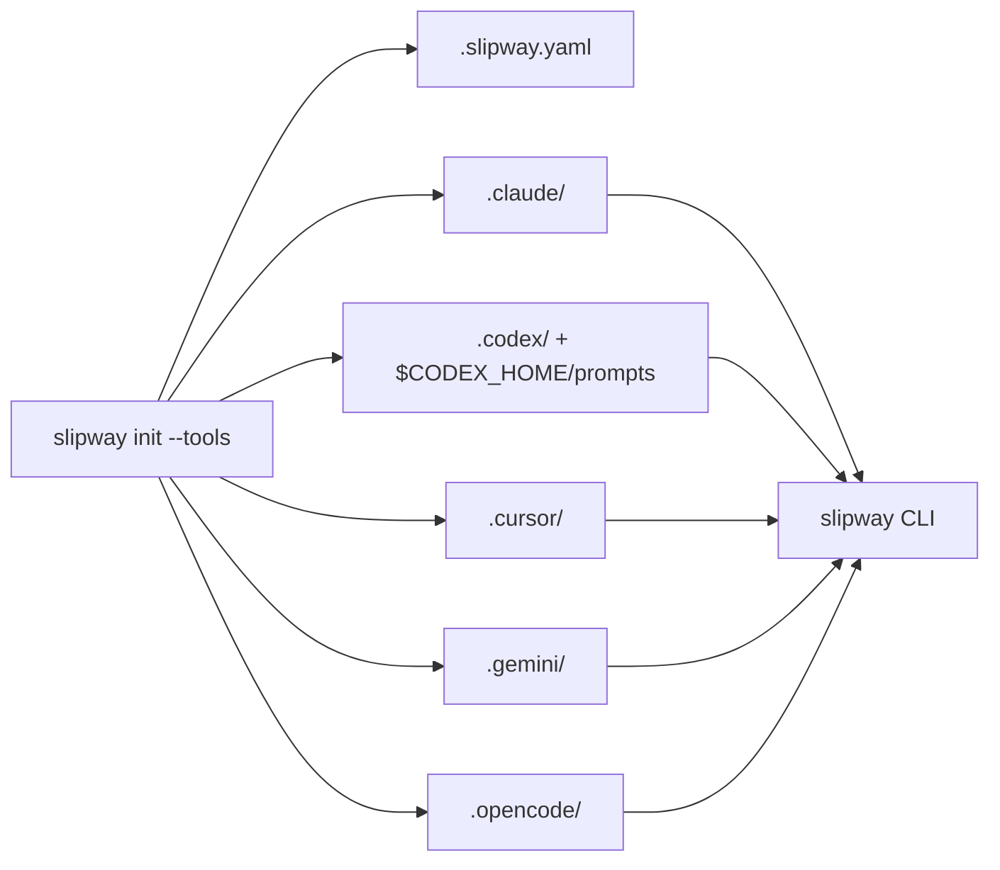

# AI Tool Adapters

`slipway init --tools` exports host-tool files that let AI coding tools invoke Slipway commands and load governed skill instructions from the current project.



## Supported Tools

| Tool ID | Skills path | Command path | Invocation style |
| --- | --- | --- | --- |
| `claude` | `.claude/skills/slipway-*/SKILL.md` | `.claude/commands/slipway/*.md` | `/slipway:<command>` |
| `codex` | `.codex/skills/slipway-*/SKILL.md` | `$CODEX_HOME/prompts/slipway-*.md` | `$slipway-<command>` |
| `cursor` | `.cursor/skills/slipway-*/SKILL.md` | `.cursor/commands/*.md` | `/slipway-<command>` |
| `gemini` | `.gemini/skills/slipway-*/SKILL.md` | `.gemini/commands/slipway/*.toml` | `/slipway-<command>` |
| `opencode` | `.opencode/skills/slipway-*/SKILL.md` | `.opencode/commands/slipway-*.md` | `/slipway-<command>` |

Codex command prompts are global because Codex consumes prompt files from its home directory. If `CODEX_HOME` is unset, Slipway uses `~/.codex`.

## Generate Adapters

```bash
slipway init --tools claude
slipway init --tools codex,opencode
slipway init --tools all
```

Refresh managed files:

```bash
slipway init --tools all --refresh
```

Refresh auto-detected managed adapters:

```bash
slipway init --refresh
```

Slipway detects adapters by its generated markers, not by a bare `.claude`, `.codex`, `.cursor`, `.gemini`, or `.opencode` directory alone.

## Generated Command Surface

Core prompt-backed commands:

- `new`
- `next`
- `run`
- `status`
- `done`

Situational prompt-backed commands:

- `init`
- `cancel`
- `review`
- `validate`
- `checkpoint`
- `preset`
- `pivot`
- `abort`
- `repair`

Diagnostics commands are CLI-only and documented in generated command references where appropriate:

- `learn`
- `stats`
- `health`
- `codebase-map`

## OpenCode Notes

OpenCode stores project commands as Markdown files under `.opencode/commands/`. Slipway generates flat OpenCode command files under:

```text
.opencode/commands/
```

The command file name becomes the OpenCode command ID. For example:

```text
.opencode/commands/slipway-new.md
```

is invoked as:

```text
/slipway-new
```

Some OpenCode builds display project commands with a project prefix in the command picker. The generated file path remains the stable Slipway contract.

Generated OpenCode skills live under:

```text
.opencode/skills/
```

and the advisory session hook is:

```text
.opencode/hooks/slipway-session-start.sh
```

## Safety Rules

- Do not edit generated Slipway adapter files unless you are intentionally customizing local host behavior.
- Use `slipway init --refresh` to update generated files after Slipway changes.
- Preserve user-owned files in adjacent AI-tool directories.
- Commit `.slipway.yaml` when the repository should be initialized for all contributors; review generated adapter files according to the repository's policy before committing them.
