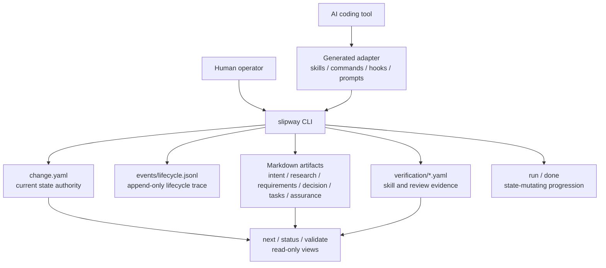

# Design Philosophy

Slipway is a small governance control plane for local AI-assisted development. It does not replace an AI coding tool, a project tracker, or Git. It makes agent work legible by binding every change to a lifecycle, a current authority file, and evidence that can be inspected after the session ends.

## Principles

| Principle | Meaning |
| --- | --- |
| Local-first | The repository contains the active state and audit trail. A hosted service can be useful later, but it is not required to understand a change. |
| One authority | `change.yaml` owns current lifecycle state. Lifecycle logs explain how state changed; they do not replace current state. |
| Bounded autonomy | Agents can move work forward, but Slipway exposes gates, blockers, review requirements, and done-ready proof. |
| Adapter thinness | Claude, Codex, Cursor, Gemini, and OpenCode surfaces route into the CLI. They should not become separate governance engines. |
| Artifact traceability | Intent, research, requirements, decisions, tasks, execution evidence, review evidence, and assurance remain connected. |
| Fresh verification | A completion claim is valid only when current evidence proves the current worktree state. |

## Architecture Model

The separation matters. `next`, `status`, and `validate` can recompute readiness without mutating lifecycle authority. `run` and `done` are explicit mutation surfaces. Generated host files help AI tools discover the right action, but the CLI remains the execution authority.

## Design Comparisons

Slipway names adjacent systems to clarify design tradeoffs. The comparison is about where authority lives, how much workflow becomes runtime, and which surfaces remain adapters. Slipway's stance is a small local governance kernel with explicit evidence and mutation boundaries.

| Adjacent system | Design logic | Slipway stance |
| --- | --- | --- |
| spec-kitty | Mission/work-package runtime with lanes, doctrine loading, optional dashboard/orchestrator surfaces, and worktree scheduling. | Keep one governed change bundle at a time, with `change.yaml` as current-state authority and lifecycle events as trace; do not import lane/platform scheduling. |
| OpenSpec | Lightweight change/spec artifacts and broad slash-command/tool delivery so teams can align before code. | Keep artifact evidence, but separate read-only views (`next`, `status`, `validate`) from mutating surfaces (`run`, `done`) and keep the CLI as authority. |
| Spec Kit | Spec-driven development scaffolding with integration management, official-source install guidance, and multi-agent command templates. | Document Slipway-owned release channels and generated adapter paths, but avoid turning adapter installation into project governance authority. |
| Superpowers | Host-skill methodology drives agent behavior through reusable workflow discipline. | Use generated skills as procedural handoffs and evidence prompts; completion remains governed by Slipway artifacts and fresh verification. |
| GSD | Broad workflow framework with audience-indexed docs, command references, and meta-prompted agent roles. | Keep user/operator docs navigable by task while limiting runtime scope to auditable lifecycle transitions and recovery commands. |
| OpenCode | Host command UX stores project commands under `.opencode/commands/` and routes prompt execution through the tool. | Generate OpenCode commands as one adapter surface; the stable contract is the generated file path and CLI command, not OpenCode-specific governance state. |

## Non-Goals

- Slipway does not infer a full project plan without governed artifacts.
- Slipway does not make AI-tool generated files authoritative over CLI state.
- Slipway does not treat a green test run as sufficient closeout when review or assurance evidence is missing.
- Slipway does not hide local state mutations behind read-only commands.

## What Counts As Complete

A governed change is complete only when the worktree, artifact bundle, verification records, and lifecycle state all agree.

1. The objective is represented in `intent.md` and the requirements contract.
2. Implementation files and docs satisfy the requirements.
3. Task evidence is fresh for the current execution run.
4. Spec and quality review records pass.
5. Final verification proves the stated acceptance criteria.
6. `slipway done` archives the terminal state after done-ready closeout.
