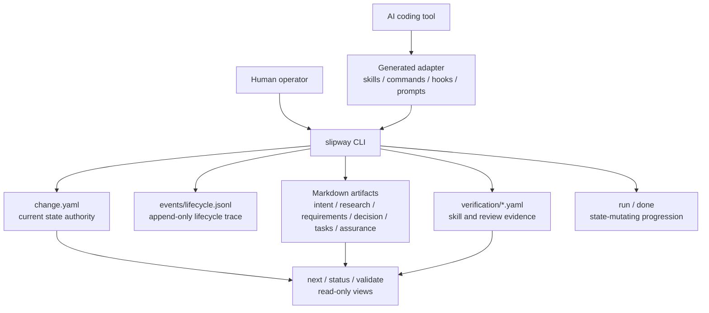

# Design Philosophy

Slipway is a small governance control plane for local AI-assisted development. It does not replace an AI coding tool, a project tracker, or Git. It makes agent work legible by binding every change to a lifecycle, a current authority file, and evidence that can be inspected after the session ends.

## Principles

| Principle | Meaning |
| --- | --- |
| Local-first | The repository contains the active state and audit trail. A hosted service can be useful later, but it is not required to understand a change. |
| One authority | `change.yaml` owns current lifecycle state. Lifecycle logs explain how state changed; they do not replace current state. |
| Bounded autonomy | Agents can move work forward, but Slipway exposes gates, blockers, review requirements, and done-ready proof. |
| Adapter thinness | Claude, Codex, Cursor, Gemini, and OpenCode surfaces route into the CLI. They should not become separate governance engines. |
| Artifact traceability | Intent, research, requirements, decisions, tasks, execution evidence, review evidence, and assurance remain connected. |
| Fresh verification | A completion claim is valid only when current evidence proves the current worktree state. |

## Architecture Model

The separation matters. `next`, `status`, and `validate` can recompute readiness without mutating lifecycle authority. `run` and `done` are explicit mutation surfaces. Generated host files help AI tools discover the right action, but the CLI remains the execution authority.

## Borrowed Patterns

Slipway's documentation and workflow shape intentionally borrow patterns from local reference projects while keeping Slipway's own model.

| Reference | Borrowed pattern | Slipway adaptation |
| --- | --- | --- |
| spec-kitty | Task-oriented docs categories and documentation verification notes. | Docs are organized by adoption task, operation task, reference, and contribution path. |
| OpenSpec | Tool matrix and non-interactive setup documentation. | `slipway init --tools` documents each supported adapter path and command style. |
| Spec Kit | Installation safety, integration keys, and official-source caveats. | Install docs separate release archives, package channels, source builds, and AI-tool initialization. |
| Superpowers | Natural-language agent installation prompt. | Slipway provides a copy-paste prompt that tells an AI tool how to inspect, install, initialize, and verify without inventing steps. |
| GSD | Audience-indexed documentation and explicit command references. | The docs home routes new users, operators, AI-tool integrators, and contributors to different pages. |
| OpenCode | Project command files under `.opencode/commands/`. | OpenCode adapter docs name the generated `.opencode/commands/slipway-*.md` files and project command usage. |

## Non-Goals

- Slipway does not infer a full project plan without governed artifacts.
- Slipway does not make AI-tool generated files authoritative over CLI state.
- Slipway does not treat a green test run as sufficient closeout when review or assurance evidence is missing.
- Slipway does not hide local state mutations behind read-only commands.

## What Counts As Complete

A governed change is complete only when the worktree, artifact bundle, verification records, and lifecycle state all agree.

1. The objective is represented in `intent.md` and the requirements contract.
2. Implementation files and docs satisfy the requirements.
3. Task evidence is fresh for the current execution run.
4. Spec and quality review records pass.
5. Final verification proves the stated acceptance criteria.
6. `slipway done` archives the terminal state after done-ready closeout.
