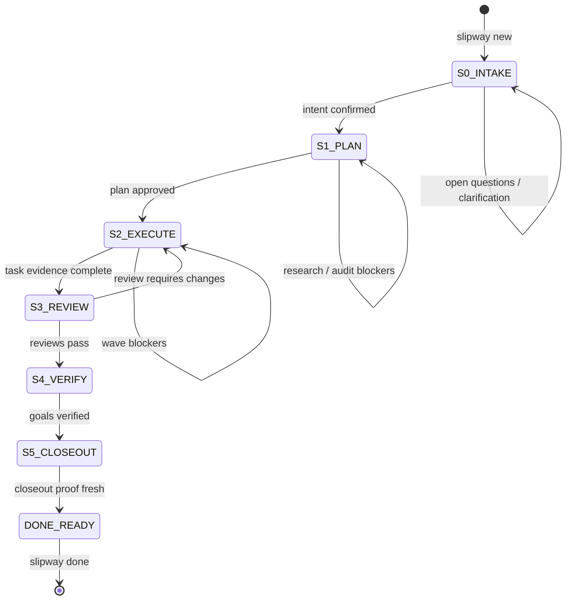

# Governed Workflow

Slipway routes work through a governed lifecycle:

1. `S0_INTAKE`: capture intent, scope, open questions, and initial evidence.
2. `S1_PLAN`: produce research, requirements, decision, task, assurance, and plan-audit artifacts.
3. `S2_EXECUTE`: execute dependency-ordered waves from `tasks.md`.
4. Review and closeout stages: verify implementation against artifacts, run quality checks, and finalize done-ready work.

The active lifecycle state is stored in `artifacts/changes/<slug>/change.yaml`.



## Create A Change

```bash
slipway new "refresh governance docs" --preset standard
```

JSON stdin lets AI callers provide classification directly:

```bash
echo '{"guardrail_domain":"","needs_discovery":true,"complexity":"complex","test_cmd":"go test ./...","build_cmd":"go build ./...","languages":["Go","Markdown"]}' \
  | slipway new --json "refresh governance docs"
```

When classification is omitted, Slipway uses conservative defaults:

- `guardrail_domain=""`
- `needs_discovery=true`
- `complexity="complex"`

## Progression Styles

Use `next` for explicit handoff control:

```bash
slipway next --json
# complete the surfaced skill or resolve blockers
slipway run --json
slipway next --json
```

Use `run` when you want Slipway to advance until an operator-facing stop:

```bash
slipway run --json --diagnostics
```

`run` stops on a surfaced skill, blocker, checkpoint, or done-ready outcome.

## Read-Only Surfaces

These commands inspect state without mutating lifecycle authority:

- `slipway next`
- `slipway status`
- `slipway validate`
- `slipway learn --preview`

Use `--json` for machine-readable output. Use `--diagnostics` on `next` or `run` when you need gate details, artifact readiness, transition traces, or context-budget diagnostics.

## Open Questions Semantics

`intent.md` may contain a canonical `## Open Questions` section. Slipway treats these entries as resolved:

```markdown
## Open Questions
(none)
```

```markdown
## Open Questions
- None.
```

```markdown
## Open Questions
- [x] Installer path resolved by research.
```

These entries remain blockers:

```markdown
## Open Questions
- [ ] Which installer path should be documented?
```

```markdown
## Open Questions
- Which docs build command should be used?
```

```markdown
## Open Questions
Need to decide which adapter layout should be documented.
```

This lets an artifact preserve the question history without keeping intake stuck after clarification is complete.

## Done

When the governed state is done-ready:

```bash
slipway done --json
```

`done` finalizes the active change and archives terminal state. If local state looks inconsistent after interruption, inspect first with `slipway health --doctor`, then run `slipway repair` if the suggested repairs match the issue.
