# Code Review Protocol

```
IRON LAW: NO APPROVAL WITHOUT LINE-LEVEL VERIFICATION OF CHANGED CODE
```

Violating the letter of this rule is violating the spirit of this rule.

## Purpose
Run consistent, evidence-based reviews that prioritize correctness, safety, and traceable findings. Reviews produce actionable output, not opinions.

## Workflow Graph (Graphviz DOT)

```dot
digraph CodeReview {
  rankdir=LR;
  node [shape=box];
  scope [label="1. Confirm scope\nfiles + requirements"];
  correct [label="2. Correctness\nlogic, branches, contracts"];
  quality [label="3. Quality\nreadability, duplication"];
  safety [label="4. Safety\nauth, data, irreversible"];
  tests [label="5. Test coverage\nrisk + edge cases"];
  summary [label="6. Findings summary\nseverity + remediation"];
  decide [shape=diamond, label="Critical\nissues?"];
  approve [label="Approve"];
  block [label="Block\nrequire fixes"];

  scope -> correct -> quality -> safety -> tests -> summary;
  summary -> decide;
  decide -> block [label="yes"];
  decide -> approve [label="no"];
}
```


## Detailed Process

### 1. Confirm Scope
Before reading any code:
- List ALL changed files (use `git diff --name-only <base>..HEAD`)
- For each file, identify which requirement or acceptance criterion it claims to satisfy
- If a changed file has no clear requirement mapping, flag it as "scope question"

### 2. Correctness Review (FIRST — most important)
For EACH changed file, review line by line:
- **Logic errors**: Off-by-one, null/nil handling, boundary conditions, type mismatches
- **Missing branches**: Unhandled error paths, missing else/default cases, unchecked returns
- **Broken contracts**: Function signatures that don't match callers, interface violations, API changes without consumer updates
- **Regression risk**: Does this change break any existing behavior? Check callers of modified functions.

### 3. Quality Review (SECOND)
- **Readability**: Clear naming, appropriate abstraction level, self-documenting code
- **Maintainability**: Single responsibility, minimal coupling, reasonable function length
- **Duplication**: Search for similar patterns (`grep -r "pattern" src/`). If 3+ copies exist, recommend extraction.
- **Consistency**: Follows project conventions (naming, file organization, error handling patterns)
- **Complexity**: Cyclomatic complexity of changed functions. Flag deeply nested logic (>3 levels).

### 4. Safety Review (THIRD)
- **Auth/AuthZ**: Are permission checks present where needed? Are tokens validated?
- **Data handling**: Is PII protected? Are inputs validated/sanitized?
- **Irreversible operations**: Do destructive operations have confirmation/undo mechanisms?
- **External contracts**: Are API changes backward-compatible? Are versioned correctly?
- **Secrets**: No hardcoded credentials, API keys, or tokens in code
- **Injection**: No SQL injection, command injection, XSS, or path traversal vulnerabilities

### 5. Test Coverage Assessment
- Changed code has corresponding test changes
- Tests cover the happy path AND at least one error/edge case per changed function
- Test assertions are meaningful (not just "no error")
- Critical paths have higher coverage requirements
- If tests are missing: this is a finding, not a skip

### 6. Findings Summary
Structure findings by severity:

**Critical** (must fix before merge):
- Logic errors, security vulnerabilities, data loss risk, broken contracts

**Important** (should fix before merge):
- Missing test coverage, duplication, poor error handling, unclear naming

**Minor** (can fix in follow-up):
- Style inconsistencies, minor naming improvements, documentation gaps

Format: `[SEVERITY] file:line — Description. Remediation: specific action.`

## Mandatory Checklist
- [ ] All changed files identified and mapped to requirements
- [ ] Each changed file reviewed line-by-line for correctness
- [ ] Quality patterns checked (naming, duplication, complexity)
- [ ] Safety scan completed (auth, data, secrets, injection)
- [ ] Test coverage assessed for each changed function
- [ ] Findings categorized by severity with file:line references
- [ ] Remediation provided for each finding

## DO NOT SKIP
1. Line-level review of changed code (not just file-level scan).
2. Safety review even if "security seems unrelated."
3. Severity categorization with specific remediation.
4. Evidence-backed claims only — reference specific lines, not impressions.
5. Remaining risk callout when uncertainty exists.

## Receiving Review Feedback
When you are the implementer receiving review findings:
- **Do NOT agree performatively** ("You're absolutely right!"). Verify technically.
- **Do NOT dismiss findings without evidence.** If you disagree, reproduce with a concrete counter-example.
- **Ask for clarification** if a finding is unclear. "What specific behavior are you concerned about?"
- **Verify each fix** by running the relevant test. Do not trust "should be fixed now."

## Rationalization Red Flags
| Rationalization | Counter-rule |
|---|---|
| "Looks fine at a glance" | Line-level review is required. Glancing is not reviewing. |
| "Tests pass so review is done" | Passing tests do not guarantee requirement coverage. |
| "Minor issue, skip comment" | Record even small regressions if behavior changes. |
| "Security seems unrelated" | Always scan for safety impact in changed paths. |
| "No time for severity ranking" | Prioritize so fixes happen in the right order. |
| "The author is experienced, they don't make mistakes" | Everyone makes mistakes. Review the code, not the author. |
| "This is just a refactor, no logic changed" | Refactors can introduce subtle behavior changes. Verify with tests. |
| "I'll trust the PR description" | Read the actual code. PR descriptions can be inaccurate or incomplete. |
| "One finding is enough feedback" | Complete the full review. Partial reviews miss systemic issues. |
| "The change is too large to review thoroughly" | Split the review by scope. Do not skip thoroughness because of size. |

## Failure Mode Handling
1. **Missing context**: Request targeted artifact/status details before proceeding. Do not review in a vacuum.
2. **Change too large**: Split review into coherent scopes (by module, by feature). Review each scope completely.
3. **Disputed findings**: Reproduce with concrete commands or examples. If you cannot reproduce, downgrade the finding.
4. **Reviewer fatigue**: Take a break between files. Do not rush the safety review because you're tired.
5. **No test infrastructure**: Flag missing test infrastructure as a Critical finding. Tests are not optional.

## Step Declaration
Declare current review phase (Scope/Correctness/Quality/Safety/Tests/Summary) before each step.
