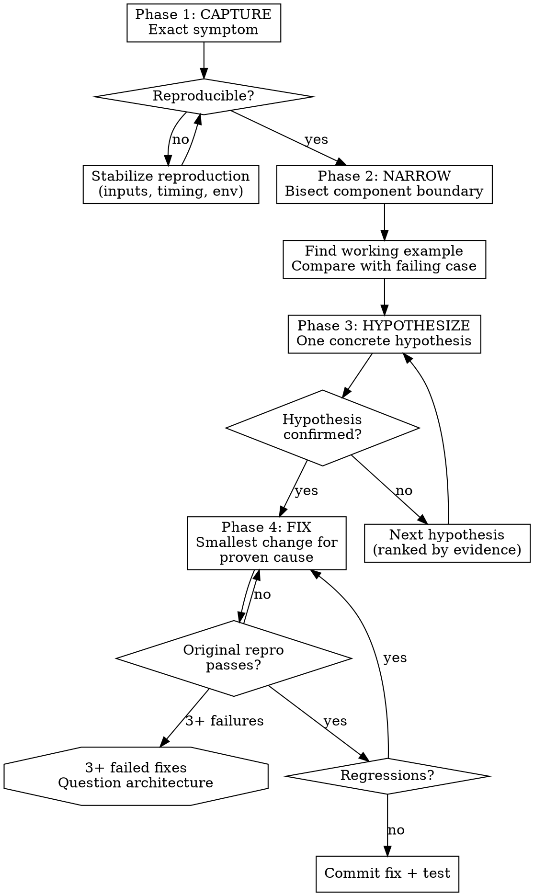

# Systematic Debugging

```
IRON LAW: NO FIXES WITHOUT ROOT CAUSE INVESTIGATION FIRST
```

Violating the letter of this rule is violating the spirit of this rule.

## Purpose
Identify root cause through controlled hypothesis testing instead of speculative edits. The goal is to understand WHY the bug exists, then fix the proven cause — never to guess and patch.

## Workflow Graph (Graphviz DOT)


## Detailed Process

### Phase 1: CAPTURE — Document the Exact Symptom
Before touching ANY code:
1. Record the exact error message, stack trace, or unexpected behavior
2. Record the exact command/input that triggers it
3. Record the environment (OS, versions, config) if relevant
4. Record what the EXPECTED behavior should be
5. **Reproduce the bug** — run the exact failing scenario and confirm the failure

If you cannot reproduce: do NOT guess. Collect more information (timing, input variants, environment differences) until reproduction is reliable.

### Phase 2: NARROW — Find the Component Boundary
1. Identify the last correct point: Where does expected behavior end and unexpected behavior begin?
2. Use binary search / bisection: Is the bug in module A or B? Add a probe at the boundary.
3. Find a working example: Search for similar code that works correctly. Compare with the failing case.
4. Check recent changes: `git log --oneline -10 -- <failing_file>` — was this code changed recently?

**Backward tracing technique**: Start from the symptom location and trace BACKWARD through the call stack to find the original trigger. The bug is often not where the error appears — it's where the bad data was first created.

### Phase 3: HYPOTHESIZE — One Hypothesis at a Time
1. Form ONE concrete, falsifiable hypothesis: "The bug is caused by X because Y"
2. Design ONE test/probe that will confirm or refute the hypothesis
3. Run the test/probe
4. If confirmed: proceed to Phase 4
5. If refuted: update your understanding and form the next hypothesis

**Do NOT test multiple hypotheses simultaneously.** Multiple changes create ambiguity about which change affected the outcome.

Rank hypotheses by evidence strength:
- Direct evidence (stack trace points here) > Circumstantial (changed recently) > Speculative (might be related)

### Phase 4: FIX — Smallest Change for Proven Cause
1. Write a failing test that captures the bug (TDD for bugs)
2. Apply the SMALLEST fix that addresses the proven root cause
3. Run the original reproduction scenario — it must pass
4. Run regression tests — they must still pass
5. If the fix doesn't work: DO NOT layer another fix on top. Revert and go back to Phase 3.

### Escalation Rule
If **3 or more fix attempts fail**, STOP fixing symptoms and question the architecture:
- Is the component design fundamentally flawed?
- Is there a deeper invariant violation upstream?
- Should this be escalated as a blocker rather than fixed in-place?

3+ failed fixes is a signal that you're treating symptoms, not the cause. Go back to Phase 2 and widen the investigation scope.

## Defense in Depth (Post-Fix)
After fixing the root cause, consider adding validation at multiple layers:
- Input validation at the entry point
- Assertion at the boundary where the bug manifested
- Test that specifically prevents regression of this bug class

This is NOT instead of root cause fixing — it is IN ADDITION to the root cause fix.

## Mandatory Checklist
- [ ] Symptom captured with exact error/command/environment
- [ ] Bug reproduced reliably before any code change
- [ ] Component boundary identified (where expected meets unexpected)
- [ ] Root cause hypothesis formed and tested
- [ ] Fix is the smallest change for the proven cause
- [ ] Failing test written that captures the bug
- [ ] Original reproduction scenario passes after fix
- [ ] Regression tests pass after fix
- [ ] No speculative fixes applied without hypothesis testing

## DO NOT SKIP
1. Reproduce before changing code. Always.
2. Keep one active hypothesis at a time. Always.
3. Verify fix with the original failing scenario. Always.
4. Write a regression test for the bug. Always.
5. Run regression tests after the fix. Always.

## Rationalization Red Flags
| Rationalization | Counter-rule |
|---|---|
| "I know the cause without reproducing" | Reproduce first; confidence is not evidence. |
| "Let's try random fixes quickly" | Random edits increase noise and delay root cause. |
| "It passed once, we're done" | Repeat to confirm stability and avoid false green. |
| "Logs are enough, no instrumentation needed" | Add targeted probes for ambiguous paths. |
| "Regression tests are unnecessary" | Validate neighboring behavior after every fix. |
| "I'll fix it and see if it helps" | That's guessing, not debugging. Prove the cause first. |
| "The stack trace says line 42, so the bug is on line 42" | The symptom is on line 42. The cause may be elsewhere. Trace backward. |
| "It's probably a race condition" | "Probably" is not a hypothesis. State the specific race and design a probe. |
| "This fix is safe enough to try" | Safe fixes still mask root causes. Understand before changing. |
| "The bug is too complex for systematic approach" | Complex bugs need MORE discipline, not less. Break into smaller investigations. |
| "Let me refactor first, then debug" | Refactoring changes the code. Debug the code AS-IS, then refactor after fix. |

## Failure Mode Handling
1. **Non-deterministic symptom**: Collect timing and input variance across 5+ runs. Look for race conditions, uninitialized state, or external dependency timing.
2. **Multiple plausible causes**: Rank by evidence strength. Test the highest-evidence hypothesis first. Do not test all at once.
3. **Invasive fix needed**: Split into smaller validated checkpoints. Each checkpoint should improve the situation measurably.
4. **Cannot reproduce locally**: Check environment differences (versions, config, data). Create a minimal reproduction case that isolates the failing behavior.
5. **Fix works but feels wrong**: If the fix is a workaround rather than a root cause fix, document it as tech debt and create a follow-up task.

## Step Declaration
Declare current phase (CAPTURE/NARROW/HYPOTHESIZE/FIX) and expected output before executing each step.
