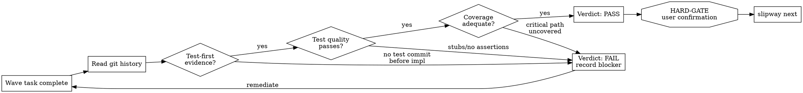

# TDD Governance

```
IRON LAW: NO PRODUCTION CODE WITHOUT A FAILING TEST FIRST
```

Violating the letter of this rule is violating the spirit of this rule.

## Purpose
Enforce test-driven development discipline during wave execution for guardrail-domain changes.
Mitigates: guardrail-domain tasks executed without test-driven proof.

## Workflow Graph (Graphviz DOT)


## When This Runs
During wave execution phase for guardrail-domain governed changes. Validates that tasks follow TDD protocol before wave orchestration verification is frozen.

## Process

### 1. Read Context
Run `slipway next --json` and read the task plan and wave execution state.

### 2. TDD Compliance Checklist (MANDATORY)
For EACH task in the current wave, verify ALL of the following:

- [ ] **Test-First Verification**: Git history shows test file commit BEFORE implementation commit for this task
- [ ] **Red Phase Evidence**: The test was observed to FAIL before implementation (not written to pass)
- [ ] **Green Phase Evidence**: Implementation is the MINIMUM change to make the test pass
- [ ] **Refactor Phase Clean**: Any refactoring was done with all tests green
- [ ] **No Stub Tests**: Every test has meaningful assertions (not `assert.True(true)` or empty bodies)
- [ ] **Coverage Gate**: New/changed code has corresponding test coverage
- [ ] **Critical Path Coverage**: Auth, data, external contracts have explicit test proof
- [ ] **Regression Scope**: Nearby tests were re-run after implementation

Each unchecked item is a BLOCKER. No partial credit.

### 3. Git History Verification Protocol
To verify test-first discipline, use this concrete method:

```bash
# For each task, check commit order
git log --oneline --name-only -- <target_files>

# Verify test file appears in an earlier commit than implementation file
# If commits are squashed, check file modification timestamps
git log --format="%H %ai" --diff-filter=AM -- <test_file>
git log --format="%H %ai" --diff-filter=AM -- <impl_file>
```

If test and implementation are in the SAME commit:
- This is NOT test-first evidence
- The implementer must demonstrate the test was written first (e.g., interim commits, branch history)
- If no evidence exists, mark as FAIL

### 4. Test Quality Assessment
Tests must be MEANINGFUL, not ceremonial:

**Pass criteria**:
- Tests assert specific behavior, not just "no error"
- Tests cover the happy path AND at least one edge case
- Tests use concrete values, not just type checks
- Tests would FAIL if the implementation were removed or stubbed

**Fail criteria** (any one triggers FAIL):
- Empty test bodies
- `assert.True(true)`, `assert.NotNil(result)` without behavior checks
- Tests that only check return type, not content
- Tests that mock the thing they're testing
- Tests with commented-out assertions

### 5. Enforcement Rules
- Tasks without test-first evidence: `fail` verdict
- Tasks with stub-only tests: `fail` verdict
- Tasks modifying critical paths without explicit test coverage: `fail` verdict
- Refactor-only tasks: may skip test-first IF existing tests cover refactored code AND tests were re-run green
- Investigation/doc tasks: TDD not applicable, skip with note

### 6. Write Verification
Verification requires `run_version` matching `verification/execution-summary.yaml`.

```yaml
# Write to: artifacts/changes/{slug}/verification/tdd-governance.yaml
verdict: pass
blockers: []
timestamp: "<ISO-8601-UTC>"
run_version: 1
references:
  - "tdd:task-001=pass:test-first-verified"
  - "tdd:task-002=pass:test-first-verified"
  - "tdd:task-003=fail:no-test-commit-before-impl"
notes: |
  <verification notes>
```

### 7. Present and Advance
Show TDD compliance summary per task. <HARD-GATE>Wait for explicit user confirmation before advancing. Do not call `slipway next` until the user approves.</HARD-GATE>

After confirmation: `slipway next`

## DO NOT SKIP
1. Test-first verification for EACH task (not a sample).
2. Git history verification (not implementer claims).
3. Coverage gate for critical paths.
4. Test quality assessment (not just "tests exist").
5. Verification record written after compliance check.

## Rationalization Red Flags
| Rationalization | Counter-rule |
|---|---|
| "Tests can be added after" | Test-first is the point of TDD governance. After is not TDD. |
| "The code is too simple to test" | Simple code gets simple tests. Complexity is not the gate. |
| "Tests pass so TDD was followed" | Passing tests do not prove test-first discipline. Check git history. |
| "Refactoring doesn't need tests" | Refactoring needs existing test coverage to be verified green. |
| "Time pressure justifies skipping" | TDD governance exists specifically to resist time pressure. |
| "One commit with test+impl is fine" | Same-commit is not test-first evidence. Separate commits required. |
| "The test is trivial but it exists" | Trivial tests with no meaningful assertions are stubs, not tests. |
| "Coverage tools say 80%, that's enough" | Coverage percentage doesn't prove test-first. Check commit order. |
| "Integration tests cover this unit" | Unit behavior needs unit tests. Integration is not a substitute. |
| "I'll fix the test after the PR" | Tests are not post-merge tasks. Fix before verification is frozen. |

## Failure Handling
- Tasks failing TDD check must be remediated before wave verification is frozen.
- If TDD compliance cannot be verified from git history, require explicit attestation with interim commit evidence from the implementer.
- If attestation is disputed, mark task as `blocked` and surface to user.
- Multiple TDD failures in a wave suggest the executor is not following the TDD technique skill — surface this pattern.

## Hard Gate Enforcement
DO NOT advance past TDD governance until the user has explicitly confirmed the compliance summary. Even if all tasks pass, the user must approve because they may have domain knowledge about test adequacy that automated checks cannot detect.

**Anti-pattern**: "All tasks have test-first evidence, advancing automatically." — TDD governance is a guardrail-domain gate. Automatic advancement defeats its purpose.

## Step Declaration
Declare current step and expected output before executing each workflow step.
