# Test-Driven Development

```
IRON LAW: NO PRODUCTION CODE WITHOUT A FAILING TEST FIRST
```

Violating the letter of this rule is violating the spirit of this rule.
"Keep as reference, write tests first" → You'll adapt it. That's testing after. Delete means delete.

## Purpose
Apply a strict RED → GREEN → REFACTOR loop so implementation never gets ahead of verification. This is not a suggestion — it is the required development discipline for all code changes.

## Workflow Graph (Graphviz DOT)

```dot
digraph TDD {
  rankdir=LR;
  node [shape=box];
  start [label="Behavior slice\nidentified"];
  red [label="RED\nWrite failing test"];
  confirm_red [shape=diamond, label="Test fails?"];
  fix_test [label="Fix test\n(not production code)"];
  green [label="GREEN\nSmallest impl change"];
  confirm_green [shape=diamond, label="Test passes?"];
  debug [label="Debug impl\n(not test)"];
  regress [shape=diamond, label="Regressions?"];
  fix_regress [label="Fix regression\n(keep new test green)"];
  refactor [label="REFACTOR\nClean up"];
  confirm_refactor [shape=diamond, label="All tests\nstill green?"];
  revert [label="Revert refactor\nback to GREEN"];
  commit [label="Commit"];
  next [label="Next behavior slice"];

  start -> red;
  red -> confirm_red;
  confirm_red -> fix_test [label="no (test passes\nor errors)"];
  fix_test -> confirm_red;
  confirm_red -> green [label="yes"];
  green -> confirm_green;
  confirm_green -> debug [label="no"];
  debug -> confirm_green;
  confirm_green -> regress [label="yes"];
  regress -> fix_regress [label="yes"];
  fix_regress -> regress;
  regress -> refactor [label="no"];
  refactor -> confirm_refactor;
  confirm_refactor -> revert [label="no"];
  revert -> refactor;
  confirm_refactor -> commit [label="yes"];
  commit -> next;
}
```


## Detailed Process

### Phase 1: RED — Write One Failing Test
1. Identify the smallest behavior slice to implement next.
2. Write ONE test that asserts the expected behavior.
3. Run the test. It MUST fail.
4. If it passes: either the behavior already exists (verify) or the test is wrong (fix the test).
5. If it errors (compile/syntax): fix the error until you get a clean FAIL (assertion failure, not crash).

**The test defines the contract.** Once written, the test is the specification. Do not modify it during GREEN phase.

### Phase 2: GREEN — Smallest Possible Change
1. Write the MINIMUM code to make the failing test pass.
2. Do not write "clean" code. Do not write "complete" code. Write the smallest change.
3. Run the specific test. It must pass.
4. Run nearby regression tests. They must still pass.
5. If regressions appear, fix them while keeping the new test green.

**"Minimum" means minimum.** If you can make the test pass with a hardcoded return, that's a signal your test may need refinement — but the hardcoded return IS the correct GREEN step. The next RED test will force generalization.

### Phase 3: REFACTOR — Clean Up While Green
1. Improve readability, remove duplication, rename for clarity.
2. After EVERY change: run all tests. They MUST stay green.
3. If a refactor breaks a test: REVERT immediately. Do not debug the refactor. Revert to GREEN state, then try a different refactoring approach.
4. Commit after refactoring is complete and all tests are green.

### Repeat
Move to the next behavior slice. One slice = one RED-GREEN-REFACTOR cycle.
Do NOT batch multiple behavior slices into one cycle.

## Mandatory Checklist
For each behavior slice, verify:
- [ ] Test written BEFORE production code
- [ ] Test observed to FAIL (not error, not skip — FAIL)
- [ ] Implementation is the MINIMUM change to pass
- [ ] All existing tests still pass after GREEN
- [ ] Refactoring done only while green
- [ ] Commit after each complete cycle

## Test Quality Standards
A test is NOT acceptable if it:
- Has no assertions (empty body)
- Only asserts "no error" without checking behavior
- Uses `assert.True(true)` or equivalent no-ops
- Mocks the unit under test (only mock dependencies)
- Is commented out or skipped
- Tests implementation details instead of behavior

A test IS acceptable when:
- It would FAIL if the production code were deleted
- It asserts observable behavior (output, state change, side effect)
- It is readable: someone can understand WHAT is being tested without reading the implementation
- It covers at least one edge case for critical paths

## DO NOT SKIP
1. Never write production code first. If you already did: DELETE IT. Write the test. Then rewrite the production code.
2. Never mark GREEN without running the test.
3. Never refactor with red tests.
4. Never batch multiple behavior slices into one cycle.
5. Never modify the test during GREEN phase (that's moving the goalpost).

## Rationalization Red Flags
| Rationalization | Counter-rule |
|---|---|
| "It's obvious, test later" | If behavior matters, test first. Obvious code still needs proof. |
| "I changed one line so no test needed" | Small changes can still regress behavior. One line = one test. |
| "The failure is noisy, I can ignore it" | Stabilize or narrow the test, then keep RED visible. |
| "I'll refactor now and test later" | Refactor only while GREEN is confirmed. |
| "End-to-end test covers this anyway" | Keep fast focused tests for local proof. E2E is not a substitute. |
| "I already wrote the code, let me just add tests" | Delete the code. Write the test. Rewrite the code. This is not negotiable. |
| "This is just a small helper function" | Small helpers get small tests. Size doesn't exempt from TDD. |
| "The test is trivial, not worth writing" | Trivial tests take 30 seconds. Debugging untested trivial code takes 30 minutes. |
| "I need to see the code shape first" | Write the test to discover the shape. The test IS the design tool. |
| "TDD is too slow for this task" | TDD prevents rework. Rework is slower than TDD. Always. |
| "I'll keep the existing code and write tests around it" | If existing code wasn't test-driven, refactor under test or rewrite. Don't wrap bad code with tests. |

## Failure Mode Handling
1. **Flaky tests**: Isolate deterministic preconditions before proceeding. Do not ignore flakiness.
2. **Unclear minimum fix**: Reduce scope to a smaller failing assertion. The smallest test reveals the smallest fix.
3. **Refactor regressions**: Revert to last GREEN state immediately. Try a different approach. Do not debug forward.
4. **Test infrastructure missing**: Create a minimal test helper or fixture as a separate RED-GREEN cycle before the main task.
5. **Cannot write test first**: This means you don't understand the behavior yet. Research first, then write the test. If you still can't: the task needs to be broken down further.

## Step Declaration
Declare current step (RED/GREEN/REFACTOR) and expected output before executing each phase.
